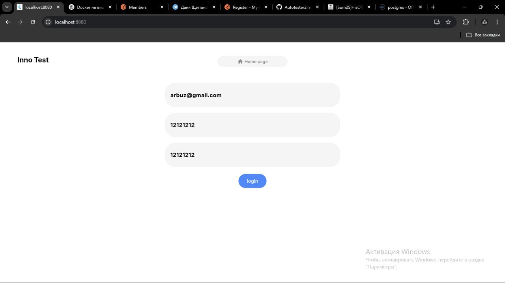

# Inno Test


### One line description
Automatically check websites using custom test cases — simple, fast, and without programming skills.

### Link to the Demo Video

https://drive.google.com/file/d/1WNYOQuKmBErRn2LTTmfNBKuwV7kP_nsL/view?usp=sharing

### Link to product

TODO

### Project Goal(s) and Description
The goal of the project is to create a simple and accessible tool for checking websites for basic interface elements such as fields, buttons, and headings. The user enters a URL and specifies what needs to be checked, and the system runs an automated test and provides a result in the form of ✅/❌ for each question.


## Implementation checklist

### Technical requirements (20 points)
#### Backend development (8 points)
- [X] Go-based microservices architecture (minimum 3 services) (3 points)

  Architecture includes testing service, check url service, authorization service, database service
- [X] RESTful API with Swagger documentation (1 point)

  **link to swagger**
- [ ] gRPC implementation for communication between microservices (1 point)

  Have not used gRPC
- [X] PostgreSQL database with proper schema design (1 point)

  **Add link to schema here**
- [X] JWT-based authentication and authorization (1 point)

  Implemented JWT-authentication
- [X] Comprehensive unit and integration tests (1 point)

  Implemented tests

#### Frontend development (8 points)
- [X] Flutter-based cross-platform application (mobile + web) (3 points)

  Made cross-platform flutter app
- [X] Responsive UI design with custom widgets (1 point)

  UI design is responsive and has custom widgets
- [X] State management implementation (1 point)

  Used Provider
- [X] Offline data persistence (1 point)

  Have sign in and sign up form with database
- [X] Unit and widget tests (1 point)

  Implemented tests
- [X] Support light and dark mode (1 point)

  Implemented theme switching

#### DevOps & deployment (4 points)
- [X] Docker compose for all services (1 point)

  Implemented
- [X] CI/CD pipeline implementation (1 point)

  Implemented
- [X] Environment configuration management using config files (1 point)

  Implemented
- [X] GitHub pages for the project (1 point)

  **Link to website**

### Non-Technical Requirements (10 points)
#### Project management (4 points)
- [X] GitHub organization with well-maintained repository (1 point)

  Link: https://github.com/Golang-Flutter-Course-Project/Autotester2inc
- [ ] Regular commits and meaningful pull requests from all team members (1 point)
- [X] Project board (GitHub Projects) with task tracking (1 point)

  Link: https://github.com/orgs/Golang-Flutter-Course-Project/projects/1
- [X] Team member roles and responsibilities documentation (1 point)

  Described in submission file on Moodle

#### Documentation (4 points)
- [X] Project overview and setup instructions (1 point)

  In README
- [X] Screenshots and GIFs of key features (1 point)

  In README
- [X] API documentation (1 point)

  Link: https://github.com/Golang-Flutter-Course-Project/Autotester2inc/tree/main/internal
- [X] Architecture diagrams and explanations (1 point)

  Link: https://github.com/Golang-Flutter-Course-Project/Autotester2inc/tree/main/internal

#### Code quality (2 points)
- [X] Consistent code style and formatting during CI/CD pipeline (1 point)

  Implemented
- [X] Code review participation and resolution (1 point)

  Code was reviewed orally on team meetings

### Bonus Features (up to 10 points)
- [ ] Localization for Russian (RU) and English (ENG) languages (2 points)
- [X] Good UI/UX design (up to 3 points)
- [X] Integration with external APIs (fitness trackers, health devices) (up to 5 points)

  Our app parses other websites and integrates with DOM architecture
- [X] Comprehensive error handling and user feedback (up to 2 points)

  Api sends proper responses to handle
- [X] Advanced animations and transitions (up to 3 points)

- [X] Widget implementation for native mobile elements (up to 2 points)

  App is cross-platform for web and mobile

Total points implemented: around 28/30 (excluding bonus points)

## Setup instructions

To setup application and run it locally you will need to clone the repository:
```bash
git clone https://github.com/Golang-Flutter-Course-Project
```

## Quality assurance

### Automated tests

To run tests:

Flutter:
```
cd frontend
flutter test
```

Go:
```
cd backend
go test ./...
```

## Build and deployment

### Continuous integration

Flutter CI:
- Link to CI: https://github.com/cQu1x/Autotester/blob/main/.github/workflows/flutter_ci.yml
- Downloads flutter
- Runs tests
- Creates build for web application (important for code updates)

Golang CI:
- Link to CI: https://github.com/Golang-Flutter-Course-Project/Autotester2inc/blob/main/.github/workflows/go-ci.yml
- Downloads Golang
- Runs tests and linting

## Screenshots of application




