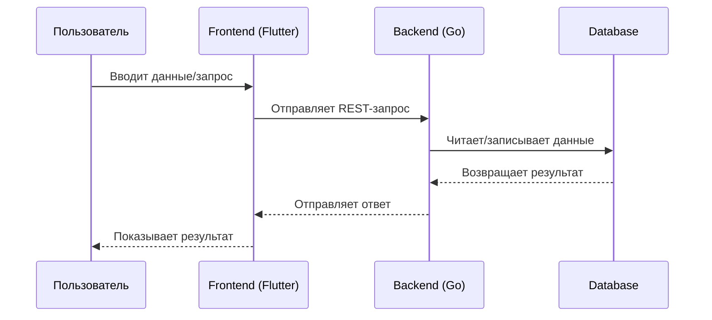

### Dynamic view
###  Sequence Diagram

```mermaid
sequenceDiagram
    participant User as Пользователь
    participant FE as Frontend (Flutter)
    participant API as Backend (Go)
    participant DB as Database

    User->>FE: Вводит данные/запрос
    FE->>API: Отправляет REST-запрос
    API->>DB: Читает/записывает данные
    DB-->>API: Возвращает результат
    API-->>FE: Отправляет ответ
    FE-->>User: Показывает результат
```
