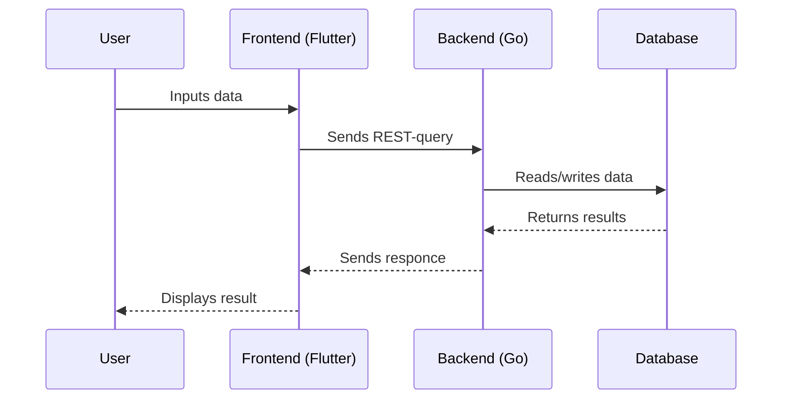

### Dynamic view
###  Sequence Diagram

```mermaid
sequenceDiagram
    participant User as User
    participant FE as Frontend (Flutter)
    participant API as Backend (Go)
    participant DB as Database

    User->>FE: Inputs data
    FE->>API: Sends REST-query
    API->>DB: Reads/writes data
    DB-->>API: Returns results
    API-->>FE: Sends responce
    FE-->>User: Displays result
```
