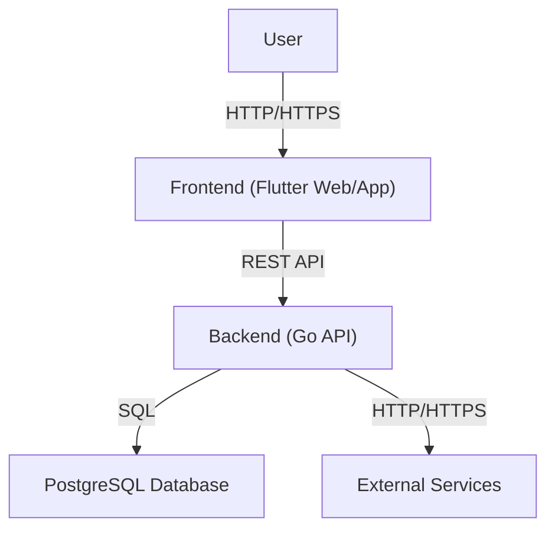

```mermaid
graph TD
    User["User"]
    Frontend["Frontend (Flutter Web/App)"]
    Backend["Backend (Go API)"]
    DB["PostgreSQL Database"]
    ExtService["External Services"]

    User -- "HTTP/HTTPS" --> Frontend
    Frontend -- "REST API" --> Backend
    Backend -- "SQL" --> DB
    Backend -- "HTTP/HTTPS" --> ExtService
```
